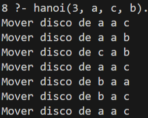
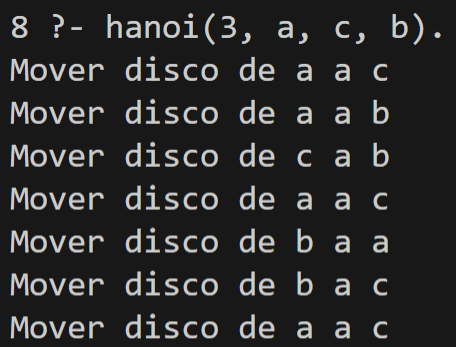

+++
date = '2026-04-20T17:58:46-08:00'
draft = false
title = 'Práctica 4: El paradigma lógico'
weight = 5
+++
---

## 1. Introducción

### 1.1 Objetivo

El objetivo de esta práctica fue explorar el **paradigma lógico** de programación mediante el lenguaje **Prolog**, implementando dos problemas clásicos de inteligencia artificial: las **Torres de Hanoi** y el problema del **Mono y la Banana**. A diferencia del paradigma funcional —explorado en la práctica anterior con Haskell—, en el paradigma lógico el programador no describe *cómo* resolver un problema, sino *qué* es verdad sobre él, dejando al motor de inferencia la tarea de encontrar la solución.

### 1.2 Herramientas utilizadas

La implementación se realizó con **SWI-Prolog**, el intérprete de Prolog más utilizado en entornos académicos y de producción.

| Herramienta | Versión | Función |
| - | - | - |
| **SWI-Prolog** | 10.0.2 | Intérprete y compilador de Prolog |
| **swipl** | 10.0.2 | Comando de línea para ejecutar archivos `.pl` |
| **VSCode** | — | Editor de código con soporte de sintaxis Prolog |

### 1.3 Conceptos clave del paradigma lógico

| Concepto | Descripción |
| - | - |
| **Hechos** | Afirmaciones incondicionales sobre el dominio (`padre(juan, maria).`) |
| **Reglas** | Relaciones condicionales definidas mediante implicación (`:-`) |
| **Consultas** | Preguntas al motor de inferencia (`?- hanoi(3, a, c, b).`) |
| **Unificación** | Mecanismo por el que Prolog empareja variables con valores |
| **Backtracking** | Retroceso automático para explorar soluciones alternativas |
| **Recursión** | Principal mecanismo de control, equivalente a los bucles en otros paradigmas |

---

## 2. Desarrollo de la práctica

### 2.1 Estructura de los archivos

Los dos problemas se implementaron en archivos `.pl` separados y se ejecutaron directamente desde PowerShell:

```
practica4/
├── hanoi_mono.pl      ← Torres de Hanoi
└── mono_banana.pl     ← El mono y la banana
```

Para cargar y ejecutar cada archivo se utilizó el siguiente flujo en la terminal:

```powershell
# Lanzar el intérprete cargando el archivo directamente
swipl hanoi_mono.pl

# Dentro del intérprete, ejecutar la consulta
?- hanoi(3, a, c, b).
```

---

### 2.2 Torres de Hanoi

#### Descripción del problema

Las Torres de Hanoi consisten en mover **N discos** de un poste de origen a uno de destino, usando un poste auxiliar, sin colocar nunca un disco más grande sobre uno más pequeño.

#### Código fuente

```prolog
% Caso base: mover un solo disco
hanoi(1, Origen, Destino, _) :-
    write('Mover disco de '), write(Origen),
    write(' a '), writeln(Destino).

% Caso recursivo
hanoi(N, Origen, Destino, Aux) :-
    N > 1,
    N1 is N - 1,
    hanoi(N1, Origen, Aux, Destino),
    write('Mover disco de '), write(Origen),
    write(' a '), writeln(Destino),
    hanoi(N1, Aux, Destino, Origen).
```

#### Análisis del código

El predicado `hanoi/4` se define con dos cláusulas:

- **Caso base** (`N = 1`): si solo hay un disco, se imprime directamente el movimiento. El cuarto argumento —el poste auxiliar— se ignora con `_`.
- **Caso recursivo** (`N > 1`): se descompone el problema en tres subproblemas. Primero se mueven los `N-1` discos superiores al auxiliar; luego se mueve el disco grande al destino; finalmente se mueven los `N-1` discos del auxiliar al destino. La recursión termina garantizando que nunca se apila un disco mayor sobre uno menor.

El número de movimientos generados sigue la fórmula **2ⁿ − 1**, lo que para 3 discos produce exactamente 7 pasos.

#### Salida obtenida



La ejecución de `?- hanoi(3, a, c, b).` generó los 7 movimientos correctos y terminó con `true.`, confirmando que el predicado se satisfizo exitosamente.

---

### 2.3 El Mono y la Banana

#### Descripción del problema

Un mono se encuentra en la puerta de una habitación. En el centro del techo hay una banana colgada. Hay una caja en la ventana. El mono debe: caminar hacia la caja, empujarla al centro, subirse encima y agarrar la banana. Este problema modela la **búsqueda en un espacio de estados**.

#### Representación del estado

El estado del mundo se representa como un término compuesto con cuatro componentes:

```prolog
estado(PosicionMono, Altura, PosicionCaja, TieneBanana)
```

| Campo | Valores posibles | Significado |
| - | - | - |
| `PosicionMono` | `puerta`, `ventana`, `centro` | Ubicación horizontal del mono |
| `Altura` | `suelo`, `encima` | Si el mono está en el suelo o encima de la caja |
| `PosicionCaja` | `puerta`, `ventana`, `centro` | Ubicación de la caja |
| `TieneBanana` | `no`, `si` | Si el mono ya agarró la banana |

#### Código fuente

```prolog
% Acción 1: caminar hacia donde está la caja
caminar(estado(_, suelo, Caja, Banana),
        estado(Caja, suelo, Caja, Banana)) :-
    write('Camina hacia la caja'), nl.

% Acción 2: empujar la caja al centro
mover_caja(estado(Pos, suelo, Pos, no),
           estado(centro, suelo, centro, no)) :-
    write('Empuja la caja al centro'), nl.

% Acción 3: subirse a la caja
subir(estado(centro, suelo, centro, no),
      estado(centro, encima, centro, no)) :-
    write('Sube a la caja'), nl.

% Acción 4: agarrar la banana
agarrar(estado(centro, encima, centro, no),
        estado(centro, encima, centro, si)) :-
    write('Agarra la banana!'), nl.

% Solución: cuatro acciones encadenadas
solucionar(E0) :-
    caminar(E0, E1),
    mover_caja(E1, E2),
    subir(E2, E3),
    agarrar(E3, _).
```

#### Análisis del código

Cada acción se define como un predicado binario que recibe un estado y produce el estado resultante. Prolog resuelve `solucionar/1` mediante **encadenamiento hacia adelante**: intenta unificar el estado inicial con las precondiciones de `caminar/2`; si tiene éxito, pasa el estado resultante a `mover_caja/2`, y así sucesivamente. Si alguna unificación falla, el motor aplica *backtracking* automáticamente para explorar caminos alternativos.

Un aspecto importante fue la corrección del predicado `mover_caja`: en la versión inicial se usaba `estado(Caja, suelo, Caja, no)`, que exige que el mono ya esté en la misma posición que la caja. Como el estado inicial tiene al mono en `puerta` y la caja en `ventana`, la unificación fallaba y el predicado retornaba `false`. La solución fue agregar el paso `caminar/2` antes de empujar, y usar `Pos` como variable de posición compartida para que Prolog unifique correctamente.

#### Salida obtenida



La ejecución de `?- solucionar(estado(puerta, suelo, ventana, no)).` imprimió los cuatro pasos de la solución y terminó con `true.`

---

### 2.4 Problemas encontrados y soluciones

| Problema | Causa | Solución |
| - | - | - |
| `ERROR: Syntax error: Operator expected` | La consulta se escribió sin el punto final `.` | Siempre terminar las consultas con `.` y presionar Enter |
| `ERROR: Unknown procedure: hanoi/4` | El intérprete se lanzó sin cargar el archivo | Ejecutar `swipl archivo.pl` o usar `[archivo].` dentro del intérprete |
| `false.` en `solucionar/1` | `mover_caja` fallaba porque el mono y la caja estaban en posiciones distintas | Agregar la acción `caminar/2` como primer paso de la solución |
| `Warning: Singleton variables: [Pos]` | Variable `Pos` declarada pero no utilizada en el cuerpo de la cláusula | Usar `_` para variables que no se necesitan, o corregir la lógica |

---

## 3. Comparativa de paradigmas

| Característica | Imperativo / OO | Funcional (Haskell) | Lógico (Prolog) |
| - | - | - | - |
| **Unidad básica** | Instrucción / Clase | Función pura | Predicado / Cláusula |
| **Control de flujo** | Bucles, condicionales | Recursión, pattern matching | Unificación, backtracking |
| **Estado** | Mutable | Inmutable | No existe estado explícito |
| **Cómo se programa** | *Cómo* resolver | *Qué* transformar | *Qué* es verdad |
| **Manejo de errores** | Excepciones | Tipos (`Maybe`, `Either`) | Fallo de unificación + backtracking |

---

## 4. Conclusiones

Esta práctica demostró las características fundamentales del paradigma lógico frente a los paradigmas explorados anteriormente.

En Prolog no se escribe un algoritmo paso a paso: se declaran **relaciones** entre estados y el motor de inferencia se encarga de encontrar una secuencia de pasos que satisfaga la consulta. Esto hace que el código sea notablemente compacto —el problema completo de las Torres de Hanoi se resuelve en 8 líneas de Prolog— pero requiere comprender con precisión cómo funciona la unificación.

El problema del Mono y la Banana evidenció la importancia de la representación del estado: un error en las precondiciones de un predicado provoca que la unificación falle silenciosamente (`false`), sin un mensaje de error explícito. Esto exige depurar el código razonando sobre qué valores intenta unificar Prolog en cada paso, lo que es una habilidad diferente a la depuración tradicional.

Como área de oportunidad, la legibilidad del código Prolog disminuye rápidamente al crecer la cantidad de predicados. Para problemas más grandes, herramientas como el trazador de SWI-Prolog (`trace/0`) o el depurador gráfico serían esenciales para seguir el árbol de búsqueda.

---

## 5. Referencias

1. Gallegos Mariscal, J. C. (s.f.). *Práctica IV: El paradigma lógico* [Material de clase]. ISyTE — Paradigmas de la Programación, UABC.
2. Tutorialspoint. (s.f.). *Prolog tutorial*. Tutorialspoint. https://www.tutorialspoint.com/prolog/index.html

# Enlaces

[GitHub](https://github.com/FernandoGonzalezBorbas/PortafolioPP "Repositorio GitHub")
[GitHub Pages](https://fernandogonzalezborbas.github.io/PortafolioPP/ "GitHub Pages")